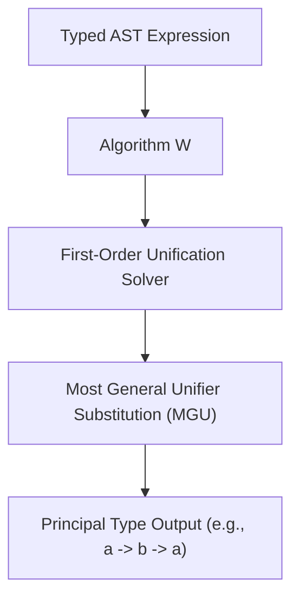

# Hindley-Milner Type Inference Skill

High-efficiency, zero-dependency Python implementation of **Hindley-Milner Type Inference (Algorithm W)** and Robinson syntactic unification.

## Features
- **Syntactic Unification**: Recursively resolves structural type equivalence and substitution constraints.
- **Principal Type Guarantees**: Infers the most general polymorphic type without requiring explicit annotations.
- **Zero External Dependencies**: Pure Python standard library.
- **Native MCP Protocol**: JSON-RPC 2.0 stdio server compatible with Claude Desktop, Cursor, and Windsurf.

## Architecture

